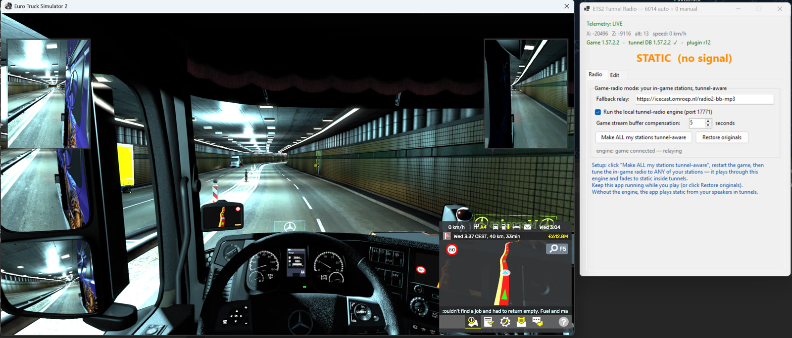
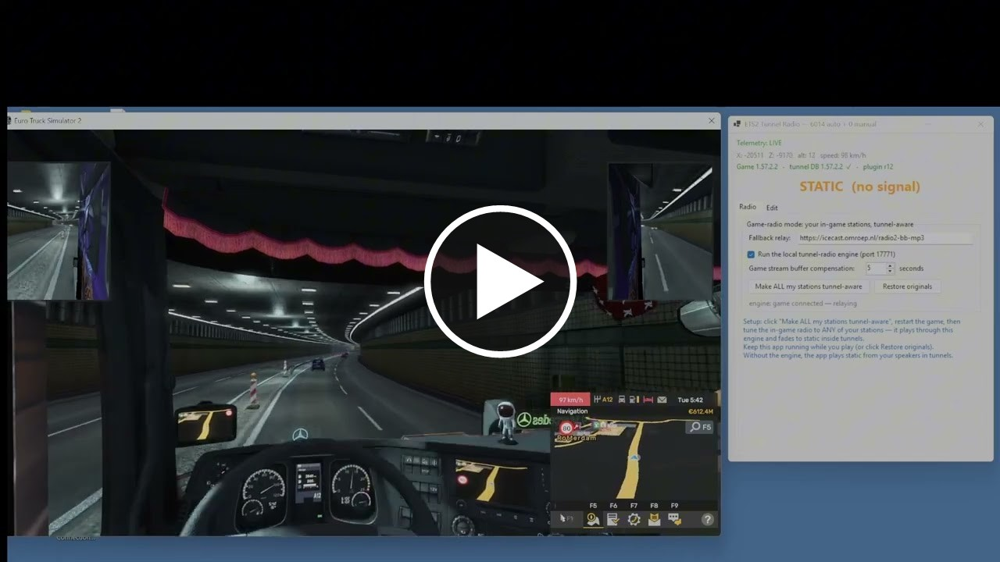
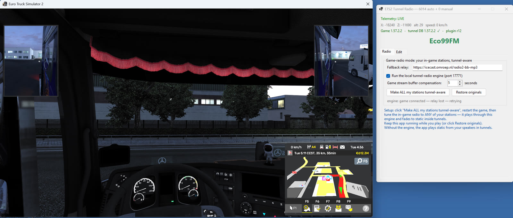

# ETS2 Tunnel Radio

> #  v0.4 — now supporting ETS2 **1.60** · **ProMods 2.83** · **Middle-East Add-on** 🇮🇱
> Two tunnel databases ship in the box — vanilla **1.60** (all map DLCs incl. Nordic Horizons)
> and **ProMods 2.83 + Middle-East** (yes, including the Carmel tunnels in Israel).
> The app **auto-detects your game version AND active map mods** and loads the matching
> database — switch between vanilla and ProMods profiles and it follows you automatically.

**Realistic radio signal loss in tunnels for Euro Truck Simulator 2.**

In real life, FM radio dies when you drive into a long tunnel. In ETS2 it plays on at
perfect quality everywhere. Tunnel Radio fixes that: drive into a tunnel and your radio
fades into crackling static — drive out and the music comes back. It works with **your
own in-game radio stations**.

**Watch the demo — with sound** (driving in, radio fades to static, driving out, music returns):

Prefer not to leave GitHub? [Play the raw MP4 here](media/demo-tunnel.mp4).

---

## Features

-  **Automatic tunnel detection** — a database of every tunnel in the map, built from
  the game's own "covered space" zone data (the same data the game uses to stop rain
  and add reverb inside tunnels). No manual setup for known tunnels.
-  **Map-aware** — ships with TWO databases (vanilla 1.60 and ProMods 2.83 + Middle-East)
  and picks the right one automatically by reading which map mods your game actually
  loaded. Drive the Carmel tunnels with an Israeli station on. 🇮🇱
-  **Works with the real in-game radio** — one click reroutes your existing station
  list through the local tunnel engine. You keep your stations, names and order;
  the in-game radio UI and volume behave exactly as before.
-  **10 different static flavors** — FM hiss, AM crackle, storm static, a distant
  station bleeding through, and more. A different one every tunnel, so it never gets
  repetitive. All procedurally generated (no copyrighted samples).
-  **FM or DAB+ behavior — your choice**: classic FM fades into crackling static;
  digital (DAB+) mode does the realistic "cliff effect" — a second of robotic
  glitching, then dead silence, and a re-lock stutter when the signal returns.
-  **Manual tunnel tagging** — for map mods or missed tunnels: press *Tag Entry* at
  the portal, *Tag Exit* at the other end. Saved forever, survives updates.
-  **Realistic threshold** — short underpasses and bridges do NOT kill the signal;
  only genuinely long covered stretches (200 m+) do, like real life.
-  **Version aware** — the app shows your game version, the tunnel-database version,
  and the telemetry plugin revision, and warns clearly if they don't match.

## Requirements

1. **Euro Truck Simulator 2 1.60.x** — the bundled databases are built and tested on 1.60.
   Vanilla DB covers the base map + all map DLCs (missing DLC regions simply never trigger).
   The ProMods database requires **ProMods 2.83 + Middle-East Add-on** active in-game.
   The app shows your game version and map mods next to the database it loaded, and warns
   clearly on any mismatch.
2. **.NET 8 Desktop Runtime** (free, one-time install from Microsoft:
   https://dotnet.microsoft.com/download/dotnet/8.0 → ".NET Desktop Runtime").
3. **Telemetry plugin** —  **included in this zip** (`telemetry-plugin\scs-telemetry.dll`,
   the standard open-source RenCloud SCS SDK plugin v1.12.1, MIT-licensed).
   Newer versions, source code and updates:
   https://github.com/RenCloud/scs-sdk-plugin/releases

## Installation

1. Unzip the release anywhere (e.g. `C:\Games\ETS2TunnelRadio\`).
2. Copy `telemetry-plugin\scs-telemetry.dll` into your game's plugin folder:
   `<game folder>\bin\win_x64\plugins\`
   (usually `C:\Program Files (x86)\Steam\steamapps\common\Euro Truck Simulator 2\bin\win_x64\plugins\` —
   create the `plugins` folder if it doesn't exist).
   The game shows a one-time "SDK features activated" confirmation on next start — press OK.
3. Run `ETS2 Tunnel Radio.exe` once — it installs its tunnel database automatically.

## Usage

1. Start the app, make sure **"Run the local tunnel-radio engine"** is ticked.
2. Click **"Make ALL my stations tunnel-aware"** (your original list is backed up —
   one click restores it).
3. Restart ETS2 and tune the in-game radio to any of your stations.
4. Drive. Enjoy losing the signal. 🎶→📡→🎶

The big label in the app shows what's happening: the station name while playing,
**STATIC** in tunnels, **RADIO OFF** when the in-game radio is off, **UNAVAILABLE**
when the game isn't running.

If the static starts noticeably too early or too late at tunnel portals, adjust
**"Game stream buffer compensation"** (the game buffers internet radio by a few
seconds; this setting predicts ahead so the static lands right at the portal).

Prefer not to touch your radio setup? Leave the engine off — the app then simply
plays static from your speakers whenever you're inside a tunnel.

### Manual tunnels (Edit tab)
Driving a map mod, or found a tunnel that doesn't trigger? Open the **Edit** tab:
drive to the tunnel entrance → **Tag Entry** → drive out the far end → **Tag Exit**.
Done — that tunnel is yours forever (stored separately, never overwritten by updates).

## Good to know

- **Keep the app running while you play** in game-radio mode — your stations route
  through it. Playing without it? Click **"Restore originals"** first (or just once,
  whenever you want your untouched list back).
- The in-game radio's **"Update from Internet"** button re-downloads SCS's station
  list and undoes the takeover — just click "Make ALL my stations tunnel-aware" again.
- Station streams must be **MP3** (the vast majority are). AAC-only streams are not
  supported yet.
- The engine listens on `127.0.0.1:17771` — local to your PC only, nothing is exposed
  to the network.
- Windows SmartScreen may warn on first run (unsigned indie tool) — "More info →
  Run anyway".

## How it works (for the curious)

- A tiny SDK plugin publishes the truck's world position to shared memory ~60×/s.
- The tunnel database is extracted from the map files: the game marks covered road
  sections with *NoWeather* zones (that's why rain stops and the engine sound gets
  that closed-in reverb in tunnels). Portal zones are bridged along the road to cover
  whole tunnels, and stretches shorter than 200 m are ignored for realism.
- The app runs a tiny local radio station: it relays your real station's stream and
  crossfades to generated static while the truck is inside a tunnel — re-encoded as
  a normal MP3 stream that the game's own radio plays.

## Credits & licenses

- **App**: © Tal, released free for the ETS2 community.
- **Telemetry**: [RenCloud/scs-sdk-plugin](https://github.com/RenCloud/scs-sdk-plugin) v1.12.1,
  MIT license — bundled in `telemetry-plugin\` together with its license text
  ([latest releases](https://github.com/RenCloud/scs-sdk-plugin/releases)).
- **Audio**: [NAudio](https://github.com/naudio/NAudio) (MIT) and
  [NAudio.Lame](https://github.com/Corey-M/NAudio.Lame) / LAME MP3 encoder (LGPL —
  the LAME library is dynamically loaded; see its license for details).
- All static sound effects are procedurally generated by the app itself.
- Map parsing during development used [truckermudgeon/maps](https://github.com/truckermudgeon/maps).

*Not affiliated with SCS Software. Euro Truck Simulator 2 is a trademark of SCS Software s.r.o.*
